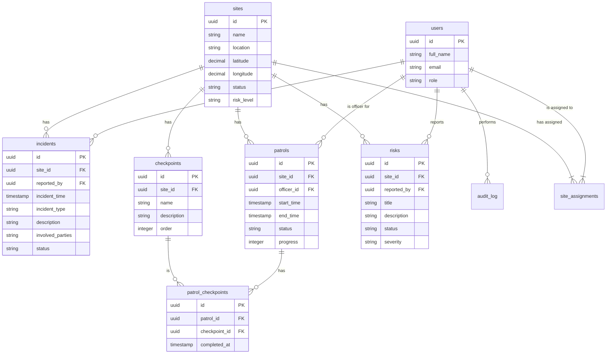
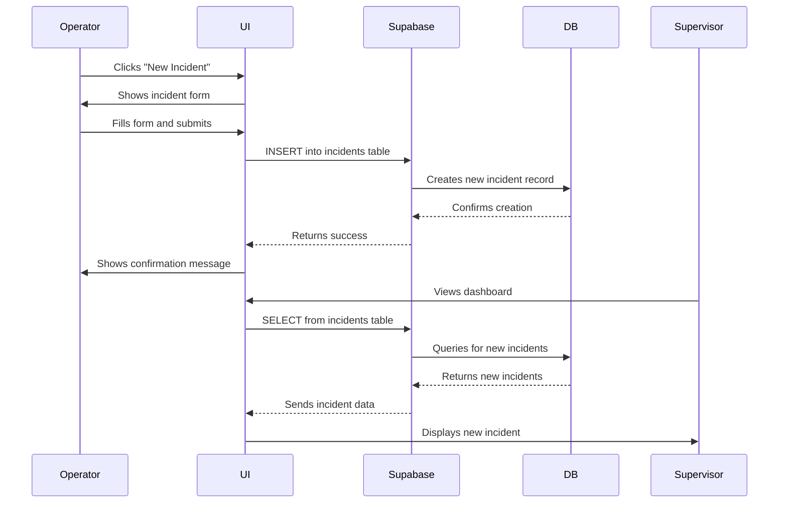

# 📂 Project Overview

This document outlines the comprehensive backend architecture for the Safety & Risk Management System (SRMS). The system is designed to be a robust, scalable, and secure platform for managing security operations, including site management, incident reporting, patrol monitoring, and risk assessment. The backend will be built on Supabase, leveraging its powerful features like PostgreSQL, Authentication, and Row Level Security (RLS).

# 🗃️ Full Database Schema

The database is designed to be relational, with clear connections between the core entities of the application.

## ERD Diagram



## Tables

### `users`

Stores user information and their roles.

| Field         | Type        | Constraints      | Description                                  |
|---------------|-------------|------------------|----------------------------------------------|
| `id`          | `uuid`      | Primary Key      | Unique identifier for the user (from Supabase Auth) |
| `full_name`   | `varchar`   |                  | User's full name                             |
| `email`       | `varchar`   | Unique           | User's email address                         |
| `role`        | `user_role` | Not Null         | User's role (`admin`, `supervisor`, `operator`, `viewer`) |
| `last_active` | `timestamptz` |                | The last time the user was active            |

### `sites`

Stores information about the managed sites.

| Field        | Type           | Constraints      | Description                               |
|--------------|----------------|------------------|-------------------------------------------|
| `id`         | `uuid`         | Primary Key      | Unique identifier for the site            |
| `name`       | `varchar`      | Not Null, Unique | Name of the site                          |
| `location`   | `varchar`      | Not Null         | Physical address of the site              |
| `latitude`   | `numeric(9,6)` |                  | Latitude for mapping                      |
| `longitude`  | `numeric(9,6)` |                  | Longitude for mapping                     |
| `status`     | `entity_status`| Default: `Active`| Current status of the site (`Active`, `Inactive`) |
| `risk_level` | `risk_level`   | Default: `Low`   | Assessed risk level (`High`, `Medium`, `Low`) |

### `incidents`

Stores information about reported incidents.

| Field                | Type              | Constraints                               | Description                               |
|----------------------|-------------------|-------------------------------------------|-------------------------------------------|
| `id`                 | `uuid`            | Primary Key                               | Unique identifier for the incident        |
| `incident_id_serial` | `bigint`          | Generated                                 | Human-readable, sequential ID             |
| `site_id`            | `uuid`            | Foreign Key to `sites.id` ON DELETE CASCADE | The site where the incident occurred      |
| `reported_by`        | `uuid`            | Foreign Key to `users.id` ON DELETE SET NULL | The user who reported the incident        |
| `incident_time`      | `timestamptz`     | Not Null                                  | When the incident occurred                |
| `incident_type`      | `varchar`         | Not Null                                  | Type of incident (`Unauthorized Entry`, `Vandalism`, etc.) |
| `description`        | `text`            |                                           | Detailed description of the incident      |
| `involved_parties`   | `varchar`         |                                           | People or vehicles involved in the incident |
| `status`             | `incident_status` | Default: `Reported`                       | Current status of the incident (`Reported`, `Under Investigation`, `Resolved`, `Closed`) |

### `patrols`

Stores information about security patrols.

| Field        | Type          | Constraints                               | Description                               |
|--------------|---------------|-------------------------------------------|-------------------------------------------|
| `id`         | `uuid`        | Primary Key                               | Unique identifier for the patrol          |
| `site_id`    | `uuid`        | Foreign Key to `sites.id` ON DELETE CASCADE | The site being patrolled                  |
| `officer_id` | `uuid`        | Foreign Key to `users.id` ON DELETE SET NULL | The officer conducting the patrol         |
| `start_time` | `timestamptz` | Not Null                                  | When the patrol started                   |
| `end_time`   | `timestamptz` |                                           | When the patrol ended                     |
| `status`     | `patrol_status` | Default: `Scheduled`                    | Current status of the patrol (`Scheduled`, `In Progress`, `Completed`, `Aborted`) |
| `progress`   | `integer`     | Default: 0                                | Percentage of patrol completion           |
| `route_name` | `varchar`     |                                           | The name of the patrol route              |

### `checkpoints`

Stores the predefined checkpoints for each site.

| Field       | Type      | Constraints               | Description                               |
|-------------|-----------|---------------------------|-------------------------------------------|
| `id`        | `uuid`    | Primary Key               | Unique identifier for the checkpoint      |
| `site_id`   | `uuid`    | Foreign Key to `sites.id` ON DELETE CASCADE | The site the checkpoint belongs to        |
| `name`      | `varchar` | Not Null                  | Name of the checkpoint (e.g., "Main Gate") |
| `description`| `text`    |                           | Instructions for the checkpoint           |
| `order`     | `integer` | Not Null                  | The order of the checkpoint in the patrol |

### `patrol_checkpoints`

A join table to track the completion of checkpoints during a patrol.

| Field          | Type        | Constraints                               | Description                               |
|----------------|-------------|-------------------------------------------|-------------------------------------------|
| `id`           | `uuid`      | Primary Key                               | Unique identifier for the record          |
| `patrol_id`    | `uuid`      | Foreign Key to `patrols.id` ON DELETE CASCADE  | The patrol the checkpoint belongs to      |
| `checkpoint_id`| `uuid`      | Foreign Key to `checkpoints.id` ON DELETE CASCADE| The checkpoint being completed            |
| `completed_at` | `timestamptz` |                                           | When the checkpoint was completed         |
| `notes`        | `text`      |                                           | Any notes recorded at the checkpoint      |

### `risks`

Stores information about identified risks.

| Field            | Type        | Constraints                               | Description                               |
|------------------|-------------|-------------------------------------------|-------------------------------------------|
| `id`             | `uuid`      | Primary Key                               | Unique identifier for the risk            |
| `hazard_id_serial` | `bigint`    | Generated                                 | Human-readable, sequential ID             |
| `site_id`        | `uuid`      | Foreign Key to `sites.id` ON DELETE CASCADE | The site where the risk was identified    |
| `reported_by`    | `uuid`      | Foreign Key to `users.id` ON DELETE SET NULL | The user who reported the risk            |
| `title`          | `varchar`   | Not Null                                  | A short title for the risk                |
| `description`    | `text`      |                                           | Detailed description of the risk          |
| `status`         | `risk_status` | Default: `Identified`                     | Current status of the risk (`Identified`, `Mitigation in Progress`, `Resolved`) |
| `severity`       | `risk_level`| Not Null                                  | The severity of the risk (`High`, `Medium`, `Low`) |

### `system_settings`

Stores system-wide configuration settings.

| Field       | Type      | Constraints | Description                                                 |
|-------------|-----------|-------------|-------------------------------------------------------------|
| `key`       | `varchar` | Primary Key | The unique key for the setting (e.g., `security_2fa_enabled`) |
| `value`     | `varchar` |             | The value of the setting (e.g., `true`, `30`)               |
| `description`| `text`    |             | A human-readable description of the setting                 |
| `category`  | `varchar` |             | Category for grouping (e.g., `Security`, `Notifications`)   |

### `audit_log`

Stores a log of all user actions and system events for auditing purposes.

| Field       | Type        | Constraints               | Description                                                          |
|-------------|-------------|---------------------------|----------------------------------------------------------------------|
| `id`        | `uuid`      | Primary Key               | Unique identifier for the log entry                                  |
| `user_id`   | `uuid`      | Foreign Key to `users.id` ON DELETE SET NULL | The user who performed the action                                    |
| `action`    | `varchar`   | Not Null                  | The action performed (e.g., `login`, `create_incident`)              |
| `details`   | `jsonb`     |                           | A JSON object with details about the action (e.g., the affected record ID) |
| `timestamp` | `timestamp` | Not Null, Default `now()` | When the action occurred                                             |

### `site_assignments`

A join table to manage which supervisors are assigned to which sites.

| Field     | Type   | Constraints                                       | Description                               |
|-----------|--------|---------------------------------------------------|-------------------------------------------|
| `id`      | `uuid` | Primary Key                                       | Unique identifier for the assignment      |
| `user_id` | `uuid` | Foreign Key to `users.id` ON DELETE CASCADE       | The user being assigned                     |
| `site_id` | `uuid` | Foreign Key to `sites.id` ON DELETE CASCADE       | The site the user is assigned to          |
|           |        | `UNIQUE(user_id, site_id)`                        | Ensures a user is assigned to a site only once |

# 🧑‍💼 Authentication & Role Management

Authentication will be handled by Supabase Auth. Users will be able to sign up and log in with email and password.

## Role Definitions

| Role        | Description                                                              |
|-------------|--------------------------------------------------------------------------|
| `admin`     | Full access to all data and settings. Can manage users and sites.        |
| `supervisor`| Can manage incidents, patrols, and risks for assigned sites. Can view reports. |
| `operator`  | Can report incidents, conduct patrols, and view assigned tasks.          |
| `viewer`    | Read-only access to dashboards and reports.                              |

## Permissions Matrix

| Action              | `admin` | `supervisor` | `operator` | `viewer` |
|---------------------|:-------:|:------------:|:----------:|:--------:|
| **Users**           | C R U D |      -       |     -      |    -     |
| **Sites**           | C R U D |      R       |     R      |    R     |
| **Incidents**       | C R U D |    C R U D   |   C R U    |    R     |
| **Patrols**         | C R U D |    C R U D   |   C R U    |    R     |
| **Risks**           | C R U D |    C R U D   |   C R U    |    R     |
| **Reports**         | C R U D |      R       |     R      |    R     |

## RLS Policy Examples

### `sites` table

```sql
-- Admins can do anything
CREATE POLICY "Admins can manage sites"
ON sites
FOR ALL
TO authenticated
USING (
  (SELECT role FROM users WHERE id = auth.uid()) = 'admin'
);

-- Authenticated users can view all sites
CREATE POLICY "Authenticated users can view sites"
ON sites
FOR SELECT
TO authenticated
USING (true);
```

### `incidents` table

```sql
-- Operators can create incidents
CREATE POLICY "Operators can create incidents"
ON incidents
FOR INSERT
TO authenticated
WITH CHECK (
  (SELECT role FROM users WHERE id = auth.uid()) = 'operator'
);

-- Supervisors can manage incidents for their sites
CREATE POLICY "Supervisors can manage incidents for their sites"
ON incidents
FOR ALL
TO authenticated
USING (
  (SELECT role FROM users WHERE id = auth.uid()) = 'supervisor'
  AND site_id IN (SELECT site_id FROM site_assignments WHERE user_id = auth.uid())
);

-- Admins can do anything
CREATE POLICY "Admins can manage incidents"
ON incidents
FOR ALL
TO authenticated
USING (
  (SELECT role FROM users WHERE id = auth.uid()) = 'admin'
);
```

### `system_settings` table

```sql
-- Admins can manage system settings
CREATE POLICY "Admins can manage system settings"
ON system_settings
FOR ALL
TO authenticated
USING (
  (SELECT role FROM users WHERE id = auth.uid()) = 'admin'
);

-- Authenticated users can read system settings
CREATE POLICY "Authenticated users can read system settings"
ON system_settings
FOR SELECT
TO authenticated
USING (true);
```

### `audit_log` table

```sql
-- Admins can view the audit log
CREATE POLICY "Admins can view the audit log"
ON audit_log
FOR SELECT
TO authenticated
USING (
  (SELECT role FROM users WHERE id = auth.uid()) = 'admin'
);

-- The system can insert into the audit log (via a trigger or function with elevated privileges)
-- No direct insert policy for users is typically needed.
```

# ⚙️ System Settings

The `system_settings` table will store configurations managed from the Settings page. This provides a flexible way to manage system behavior without requiring code changes.

| UI Setting                  | Table Key                         | Example Value | Notes                                           |
|-----------------------------|-----------------------------------|---------------|-------------------------------------------------|
| Two-Factor Authentication   | `security.2fa.enabled`            | `true`        | Enforced via Supabase Auth settings.            |
| Session Timeout             | `security.session_timeout_minutes`| `30`          | Implemented on the frontend.                    |
| Email Alerts                | `notifications.email.enabled`     | `true`        | Triggers backend functions to send emails.      |
| Data Retention              | `data.retention_period_years`     | `7`           | Used by a periodic cleanup job.                 |
| Dark Mode                   | `ui.dark_mode.enabled`            | `false`       | A client-side setting, but can be stored here.  |

# ✍️ CRUD Operations Map

| Table       | UI Component/Action | CRUD Operations                               | Notes                                                              |
|-------------|---------------------|-----------------------------------------------|--------------------------------------------------------------------|
| `sites`     | `Sites.tsx`         | `CREATE`, `READ`, `UPDATE`, `DELETE`          | Managed primarily through the "Site Management" page.              |
| `incidents` | `Dashboard.tsx`     | `CREATE`, `READ`, `UPDATE`                    | New incidents are created from the dashboard. Updates are handled by supervisors/admins. |
| `patrols`   | `Dashboard.tsx`     | `CREATE`, `READ`, `UPDATE`                    | Patrols are started from the dashboard. Progress is updated by operators. |
| `risks`     | `Dashboard.tsx`     | `CREATE`, `READ`, `UPDATE`                    | Risks are created from the dashboard. Updates are handled by supervisors/admins. |
| `users`     | `Admin.tsx`         | `CREATE`, `READ`, `UPDATE`, `DELETE`          | User management is restricted to admins.                           |

# 🔁 Workflow Mapping

## New Incident Workflow

1.  **UI (Operator):** Clicks "New Incident" on the dashboard.
2.  **UI (Operator):** Fills out the incident form and clicks "Submit Report".
3.  **API (Supabase):** An `INSERT` query is sent to the `incidents` table.
4.  **DB (PostgreSQL):** The new incident is created.
5.  **UI (Supervisor/Admin):** The new incident appears on the dashboard for review.

## System Workflow Diagram



# 🧾 SQL Scripts

## Per-Page Modular Scripts

### `sites.sql`

```sql
-- Create the sites table
CREATE TABLE sites (
    id uuid DEFAULT gen_random_uuid() PRIMARY KEY,
    name character varying NOT NULL,
    location character varying NOT NULL,
    latitude numeric,
    longitude numeric,
    status character varying,
    risk_level character varying
);

-- RLS policies for sites
CREATE POLICY "Admins can manage sites" ON sites FOR ALL TO authenticated USING ((SELECT role FROM users WHERE id = auth.uid()) = 'admin');
CREATE POLICY "Authenticated users can view sites" ON sites FOR SELECT TO authenticated USING (true);
```

### `incidents.sql`

```sql
-- Create the incidents table
CREATE TABLE incidents (
    id uuid DEFAULT gen_random_uuid() PRIMARY KEY,
    site_id uuid REFERENCES sites(id),
    reported_by uuid REFERENCES users(id),
    incident_time timestamp with time zone NOT NULL,
    incident_type character varying NOT NULL,
    description text,
    involved_parties character varying,
    status character varying DEFAULT 'Reported'::character varying
);

-- RLS policies for incidents
CREATE POLICY "Operators can create incidents" ON incidents FOR INSERT TO authenticated WITH CHECK ((SELECT role FROM users WHERE id = auth.uid()) = 'operator');
CREATE POLICY "Supervisors can manage incidents for their sites" ON incidents FOR ALL TO authenticated USING ((SELECT role FROM users WHERE id = auth.uid()) = 'supervisor' AND site_id IN (SELECT site_id FROM site_assignments WHERE user_id = auth.uid()));
CREATE POLICY "Admins can manage incidents" ON incidents FOR ALL TO authenticated USING ((SELECT role FROM users WHERE id = auth.uid()) = 'admin');
```

## Full Initialization Script

```sql
-- =================================================================
-- 📜 SRMS - FULL DATABASE INITIALIZATION SCRIPT (CORRECTED)
-- =================================================================

-- 1. EXTENSIONS
-- =================================================================
-- Enables the gen_random_uuid() function for generating unique identifiers.
CREATE EXTENSION IF NOT EXISTS pgcrypto WITH SCHEMA extensions;

-- =================================================================
-- 2. CUSTOM TYPES
-- =================================================================
-- Creates custom ENUM types to ensure data consistency for specific fields.

DROP TYPE IF EXISTS user_role;
DROP TYPE IF EXISTS entity_status;
DROP TYPE IF EXISTS risk_level;
DROP TYPE IF EXISTS incident_status;
DROP TYPE IF EXISTS patrol_status;
DROP TYPE IF EXISTS risk_status;

CREATE TYPE user_role AS ENUM ('admin', 'supervisor', 'operator', 'viewer');
CREATE TYPE entity_status AS ENUM ('Active', 'Inactive');
CREATE TYPE risk_level AS ENUM ('High', 'Medium', 'Low');
CREATE TYPE incident_status AS ENUM ('Reported', 'Under Investigation', 'Resolved', 'Closed');
CREATE TYPE patrol_status AS ENUM ('Scheduled', 'In Progress', 'Completed', 'Aborted');
CREATE TYPE risk_status AS ENUM ('Identified', 'Mitigation in Progress', 'Resolved');

-- =================================================================
-- 3. TABLE CREATION
-- =================================================================
-- Note: The order of table creation matters due to foreign key constraints.

-- Table for user information, linked to Supabase Auth.
CREATE TABLE IF NOT EXISTS public.users (
    id uuid NOT NULL PRIMARY KEY,
    full_name character varying,
    email character varying UNIQUE,
    role user_role NOT NULL,
    last_active timestamp with time zone
);
COMMENT ON TABLE public.users IS 'Stores user information and their roles. The id should link to auth.users.id.';

-- Table for managed security sites.
CREATE TABLE IF NOT EXISTS public.sites (
    id uuid DEFAULT extensions.gen_random_uuid() PRIMARY KEY,
    name character varying NOT NULL UNIQUE,
    location character varying NOT NULL,
    latitude numeric(9, 6),
    longitude numeric(9, 6),
    status entity_status DEFAULT 'Active',
    risk_level risk_level DEFAULT 'Low'
);
COMMENT ON TABLE public.sites IS 'Stores information about the managed sites.';

-- Table for assigning supervisors to specific sites.
CREATE TABLE IF NOT EXISTS public.site_assignments (
    id uuid DEFAULT extensions.gen_random_uuid() PRIMARY KEY,
    user_id uuid NOT NULL REFERENCES public.users(id) ON DELETE CASCADE,
    site_id uuid NOT NULL REFERENCES public.sites(id) ON DELETE CASCADE,
    CONSTRAINT user_site_unique UNIQUE (user_id, site_id)
);
COMMENT ON TABLE public.site_assignments IS 'Assigns users (typically supervisors) to specific sites.';

-- Table for security incidents.
CREATE TABLE IF NOT EXISTS public.incidents (
    id uuid DEFAULT extensions.gen_random_uuid() PRIMARY KEY,
    incident_id_serial BIGINT GENERATED ALWAYS AS IDENTITY, -- For human-readable IDs like INC-2024-001
    site_id uuid NOT NULL REFERENCES public.sites(id) ON DELETE CASCADE,
    reported_by uuid REFERENCES public.users(id) ON DELETE SET NULL,
    incident_time timestamp with time zone NOT NULL,
    incident_type character varying NOT NULL,
    description text,
    involved_parties character varying,
    status incident_status DEFAULT 'Reported'
);
COMMENT ON TABLE public.incidents IS 'Stores information about reported security incidents.';

-- Table for predefined patrol checkpoints at each site.
CREATE TABLE IF NOT EXISTS public.checkpoints (
    id uuid DEFAULT extensions.gen_random_uuid() PRIMARY KEY,
    site_id uuid NOT NULL REFERENCES public.sites(id) ON DELETE CASCADE,
    name character varying NOT NULL,
    description text,
    "order" integer NOT NULL
);
COMMENT ON TABLE public.checkpoints IS 'Stores the predefined checkpoints for each site patrol route.';

-- Table for security patrols.
CREATE TABLE IF NOT EXISTS public.patrols (
    id uuid DEFAULT extensions.gen_random_uuid() PRIMARY KEY,
    site_id uuid NOT NULL REFERENCES public.sites(id) ON DELETE CASCADE,
    officer_id uuid REFERENCES public.users(id) ON DELETE SET NULL,
    start_time timestamp with time zone NOT NULL,
    end_time timestamp with time zone,
    status patrol_status DEFAULT 'Scheduled',
    progress integer DEFAULT 0,
    route_name character varying
);
COMMENT ON TABLE public.patrols IS 'Stores information about security patrols.';

-- Join table to track the completion of checkpoints during a patrol.
CREATE TABLE IF NOT EXISTS public.patrol_checkpoints (
    id uuid DEFAULT extensions.gen_random_uuid() PRIMARY KEY,
    patrol_id uuid NOT NULL REFERENCES public.patrols(id) ON DELETE CASCADE,
    checkpoint_id uuid NOT NULL REFERENCES public.checkpoints(id) ON DELETE CASCADE,
    completed_at timestamp with time zone,
    notes text
);
COMMENT ON TABLE public.patrol_checkpoints IS 'Tracks completion of individual checkpoints within a patrol.';

-- Table for identified security and safety risks.
CREATE TABLE IF NOT EXISTS public.risks (
    id uuid DEFAULT extensions.gen_random_uuid() PRIMARY KEY,
    hazard_id_serial BIGINT GENERATED ALWAYS AS IDENTITY, -- For human-readable IDs like HAZ-2024-001
    site_id uuid NOT NULL REFERENCES public.sites(id) ON DELETE CASCADE,
    reported_by uuid REFERENCES public.users(id) ON DELETE SET NULL,
    title character varying NOT NULL,
    description text,
    status risk_status DEFAULT 'Identified',
    severity risk_level NOT NULL
);
COMMENT ON TABLE public.risks IS 'Stores information about identified risks and hazards.';

-- Table for system-wide configuration settings.
CREATE TABLE IF NOT EXISTS public.system_settings (
    key character varying PRIMARY KEY,
    value character varying,
    description text,
    category character varying
);
COMMENT ON TABLE public.system_settings IS 'Stores system-wide configuration settings.';

-- Table for logging user actions and system events.
CREATE TABLE IF NOT EXISTS public.audit_log (
    id uuid DEFAULT extensions.gen_random_uuid() PRIMARY KEY,
    user_id uuid REFERENCES public.users(id) ON DELETE SET NULL,
    action character varying NOT NULL,
    details jsonb,
    timestamp timestamp with time zone DEFAULT now() NOT NULL
);
COMMENT ON TABLE public.audit_log IS 'Stores a log of all user actions and system events for auditing.';


-- =================================================================
-- 4. MOCK DATA INSERTION
-- =================================================================
-- Note: Replace these UUIDs with the actual UUIDs from your Supabase Auth users.
-- You can find user UUIDs in the "Authentication" -> "Users" section of your Supabase dashboard.

-- Mock Users
INSERT INTO public.users (id, full_name, email, role, last_active) VALUES
('00000000-0000-0000-0000-000000000001', 'Admin Davis', 'davis@security.com', 'admin', '2024-08-03 16:00:00+0'),
('00000000-0000-0000-0000-000000000002', 'Officer Johnson', 'johnson@security.com', 'operator', '2024-08-03 15:30:00+0'),
('00000000-0000-0000-0000-000000000003', 'Officer Smith', 'smith@security.com', 'operator', '2024-08-03 14:45:00+0'),
('00000000-0000-0000-0000-000000000004', 'Supervisor Lee', 'lee@security.com', 'supervisor', '2024-08-03 17:00:00+0'),
('00000000-0000-0000-0000-000000000005', 'Officer Brown', 'brown@security.com', 'operator', '2024-08-02 18:00:00+0');

-- Mock Sites (using DECLARE for easy reference)
DO $$
DECLARE
    gerehu_site_id uuid;
    waini_site_id uuid;
    kila_site_id uuid;
    boroko_site_id uuid;
    waigani_site_id uuid;
    
    gerehu_main_gate_id uuid;
    gerehu_perimeter_north_id uuid;
    gerehu_chapel_entrance_id uuid;

    patrol_001_id uuid;
BEGIN
    -- Mock Sites
    INSERT INTO public.sites (name, location, latitude, longitude, status, risk_level) VALUES
    ('Gerehu LDS Stake', 'Gerehu, Port Moresby', -9.4045, 147.1545, 'Active', 'Medium'),
    ('Waini LDS Branch', 'Waini, Port Moresby', -9.4761, 147.1832, 'Active', 'High'),
    ('Kila Kila LDS Ward', 'Kila Kila, Port Moresby', -9.4885, 147.1957, 'Active', 'Low'),
    ('Boroko Office Complex', 'Boroko, Port Moresby', -9.4679, 147.1932, 'Active', 'Medium'),
    ('Waigani Warehouse', 'Waigani, Port Moresby', -9.4143, 147.1836, 'Inactive', 'Low');

    -- Get Site IDs
    SELECT id INTO gerehu_site_id FROM sites WHERE name = 'Gerehu LDS Stake';
    SELECT id INTO waini_site_id FROM sites WHERE name = 'Waini LDS Branch';
    SELECT id INTO kila_site_id FROM sites WHERE name = 'Kila Kila LDS Ward';

    -- Mock Site Assignments
    INSERT INTO public.site_assignments (user_id, site_id) VALUES
    ('00000000-0000-0000-0000-000000000004', gerehu_site_id), -- Supervisor Lee manages Gerehu
    ('00000000-0000-0000-0000-000000000004', waini_site_id);  -- and Waini

    -- Mock Incidents
    INSERT INTO public.incidents (site_id, reported_by, incident_time, incident_type, description, status) VALUES
    (gerehu_site_id, '00000000-0000-0000-0000-000000000002', '2024-08-03 14:30:00+0', 'Unauthorized Entry Attempt', 'Individual attempted to enter through side gate after hours.', 'Under Investigation'),
    (waini_site_id, '00000000-0000-0000-0000-000000000003', '2024-08-02 09:15:00+0', 'Vandalism Report', 'Graffiti found on exterior wall, cleaned and documented.', 'Resolved'),
    (kila_site_id, '00000000-0000-0000-0000-000000000005', '2024-08-01 22:05:00+0', 'Suspicious Vehicle', 'A black sedan was parked near the back fence for over an hour.', 'Closed'),
    (waini_site_id, '00000000-0000-0000-0000-000000000003', '2024-08-03 11:00:00+0', 'Theft', 'Gardening equipment reported missing from storage shed.', 'Reported'),
    (gerehu_site_id, '00000000-0000-0000-0000-000000000002', '2024-07-30 15:00:00+0', 'Safety Hazard', 'Water leak in main hallway causing slip hazard.', 'Resolved');

    -- Mock Risks
    INSERT INTO public.risks (site_id, reported_by, title, description, status, severity) VALUES
    (gerehu_site_id, '00000000-0000-0000-0000-000000000002', 'Uneven Pavement Near Chapel Entrance', 'Significant cracks and uneven pavement on the main walkway to the chapel entrance, posing a trip hazard.', 'Identified', 'High'),
    (waini_site_id, '00000000-0000-0000-0000-000000000003', 'Faulty Light in North Parking Lot', 'The main floodlight in the north parking area is flickering and often turns off.', 'Mitigation in Progress', 'Medium'),
    (gerehu_site_id, '00000000-0000-0000-0000-000000000004', 'Overgrown Bushes Obstructing South Fence', 'Bushes along the southern fence line are overgrown, creating blind spots.', 'Resolved', 'Low'),
    (kila_site_id, '00000000-0000-0000-0000-000000000005', 'No CCTV coverage on West Perimeter', 'The west perimeter fence has no CCTV coverage, making it a potential entry point.', 'Identified', 'Medium'),
    (waini_site_id, '00000000-0000-0000-0000-000000000004', 'Outdated Fire Extinguishers', 'Fire extinguishers in the main hall have not been serviced this year.', 'Identified', 'High');

    -- Mock Checkpoints for Gerehu Site
    INSERT INTO public.checkpoints (site_id, name, description, "order") VALUES
    (gerehu_site_id, 'Main Gate', 'Entry and exit point', 1),
    (gerehu_site_id, 'Perimeter Fence (North)', 'Check for breaches', 2),
    (gerehu_site_id, 'Chapel Entrance', 'Verify locks and access', 3),
    (gerehu_site_id, 'Parking Lot', 'Scan for unauthorized vehicles', 4),
    (gerehu_site_id, 'Generator Room', 'Check fuel levels and status', 5),
    (gerehu_site_id, 'Perimeter Fence (South)', 'Check for breaches', 6);

    -- Mock Checkpoints for Waini Site
    INSERT INTO public.checkpoints (site_id, name, description, "order") VALUES
    (waini_site_id, 'Main Gate', 'Entry and exit point', 1),
    (waini_site_id, 'Office Building', 'Check all doors and windows', 2),
    (waini_site_id, 'Storage Shed', 'Verify lock is secure', 3);

    -- Mock Patrols
    INSERT INTO public.patrols (site_id, officer_id, start_time, end_time, status, progress, route_name) VALUES
    (gerehu_site_id, '00000000-0000-0000-0000-000000000002', '2024-08-03 14:00:00+0', NULL, 'In Progress', 63, 'Perimeter + Interior'),
    (waini_site_id, '00000000-0000-0000-0000-000000000003', '2024-08-03 10:00:00+0', '2024-08-03 11:30:00+0', 'Completed', 100, 'Standard Route A'),
    (kila_site_id, '00000000-0000-0000-0000-000000000005', '2024-08-04 08:00:00+0', NULL, 'Scheduled', 0, 'Quick Check'),
    (gerehu_site_id, '00000000-0000-0000-0000-000000000002', '2024-08-02 14:00:00+0', '2024-08-02 16:00:00+0', 'Completed', 100, 'Perimeter + Interior'),
    (waini_site_id, '00000000-0000-0000-0000-000000000003', '2024-08-04 18:00:00+0', NULL, 'Scheduled', 0, 'Evening Lock-up');

    -- Get Patrol 001 ID
    SELECT id INTO patrol_001_id FROM patrols WHERE officer_id = '00000000-0000-0000-0000-000000000002' AND status = 'In Progress';
    
    -- Get Gerehu Checkpoint IDs
    SELECT id INTO gerehu_main_gate_id FROM checkpoints WHERE site_id = gerehu_site_id AND name = 'Main Gate';
    SELECT id INTO gerehu_perimeter_north_id FROM checkpoints WHERE site_id = gerehu_site_id AND name = 'Perimeter Fence (North)';
    SELECT id INTO gerehu_chapel_entrance_id FROM checkpoints WHERE site_id = gerehu_site_id AND name = 'Chapel Entrance';

    -- Mock Patrol Checkpoint completions for Patrol 001 (In Progress)
    INSERT INTO public.patrol_checkpoints (patrol_id, checkpoint_id, completed_at) VALUES
    (patrol_001_id, gerehu_main_gate_id, '2024-08-03 14:10:00+0'),
    (patrol_001_id, gerehu_perimeter_north_id, '2024-08-03 14:25:00+0'),
    (patrol_001_id, gerehu_chapel_entrance_id, '2024-08-03 14:40:00+0');
END $$;

-- Mock System Settings
INSERT INTO public.system_settings (key, value, description, category) VALUES
('security.2fa.enabled', 'true', 'Require 2FA for all users', 'Security'),
('security.session_timeout_minutes', '30', 'Auto-logout after 30 minutes of inactivity', 'Security'),
('security.ip_restrictions.enabled', 'false', 'Limit access to specific IP ranges', 'Security'),
('notifications.email.enabled', 'true', 'Send email notifications for critical incidents', 'Notifications'),
('notifications.sms.enabled', 'true', 'Send SMS for high-priority alerts', 'Notifications'),
('notifications.push.enabled', 'false', 'Mobile app push notifications', 'Notifications'),
('data.retention_period_years', '7', 'Keep incident data for 7 years', 'Data Management'),
('system.dark_mode.enabled', 'false', 'Use dark theme interface', 'System Configuration'),
('system.automatic_backups.enabled', 'true', 'Daily automated system backups', 'System Configuration');

-- =================================================================
-- 5. ROW LEVEL SECURITY (RLS) POLICIES
-- =================================================================
-- Note: Remember to enable RLS on each table in the Supabase UI.

-- USERS
ALTER TABLE public.users ENABLE ROW LEVEL SECURITY;
DROP POLICY IF EXISTS "Users can view their own data" ON public.users;
DROP POLICY IF EXISTS "Admins can manage users" ON public.users;
CREATE POLICY "Users can view their own data" ON public.users FOR SELECT USING (id = auth.uid());
CREATE POLICY "Admins can manage users" ON public.users FOR ALL USING (((SELECT role FROM public.users WHERE id = auth.uid()) = 'admin'::user_role));

-- SITES
ALTER TABLE public.sites ENABLE ROW LEVEL SECURITY;
DROP POLICY IF EXISTS "Admins can manage sites" ON public.sites;
DROP POLICY IF EXISTS "Authenticated users can view sites" ON public.sites;
CREATE POLICY "Admins can manage sites" ON public.sites FOR ALL USING (((SELECT role FROM public.users WHERE id = auth.uid()) = 'admin'::user_role)) WITH CHECK (((SELECT role FROM public.users WHERE id = auth.uid()) = 'admin'::user_role));
CREATE POLICY "Authenticated users can view sites" ON public.sites FOR SELECT USING (auth.role() = 'authenticated');

-- INCIDENTS
ALTER TABLE public.incidents ENABLE ROW LEVEL SECURITY;
DROP POLICY IF EXISTS "Admins can manage all incidents" ON public.incidents;
DROP POLICY IF EXISTS "Supervisors can manage incidents for their sites" ON public.incidents;
DROP POLICY IF EXISTS "Operators can create and view their own reported incidents" ON public.incidents;
DROP POLICY IF EXISTS "Authenticated viewers can see incidents" ON public.incidents;

CREATE POLICY "Admins can manage all incidents" ON public.incidents FOR ALL
    USING (((SELECT role FROM public.users WHERE id = auth.uid()) = 'admin'::user_role));

CREATE POLICY "Supervisors can manage incidents for their sites" ON public.incidents FOR ALL
    USING (((SELECT role FROM public.users WHERE id = auth.uid()) = 'supervisor'::user_role) AND (site_id IN (SELECT site_id FROM public.site_assignments WHERE user_id = auth.uid())))
    WITH CHECK (((SELECT role FROM public.users WHERE id = auth.uid()) = 'supervisor'::user_role) AND (site_id IN (SELECT site_id FROM public.site_assignments WHERE user_id = auth.uid())));

CREATE POLICY "Operators can create and view their own reported incidents" ON public.incidents FOR ALL
    USING (((SELECT role FROM public.users WHERE id = auth.uid()) = 'operator'::user_role) AND (reported_by = auth.uid()))
    WITH CHECK (((SELECT role FROM public.users WHERE id = auth.uid()) = 'operator'::user_role));

CREATE POLICY "Authenticated viewers can see incidents" ON public.incidents FOR SELECT
    USING (auth.role() = 'authenticated');


-- Add more RLS policies for other tables (patrols, risks, etc.) following the same logic.


-- =================================================================
-- END OF SCRIPT
-- =================================================================
```

# 📊 Visual Diagrams

(Included in the schema section above)

# 📝 Developer Notes

*   The `users` table will be populated by a trigger on the `auth.users` table to keep them in sync.
*   The `site_assignments` table is crucial for the supervisor RLS policies to function correctly.
*   The frontend will need to be updated to fetch data from the Supabase API instead of using the mock data.
*   The `patrol_checkpoints` `completed_at` field will be updated by the operator's device as they complete each checkpoint.
*   An `audit_log` table should be populated using database triggers on `INSERT`, `UPDATE`, and `DELETE` operations on critical tables (`incidents`, `sites`, etc.) to ensure all actions are logged.
*   The System Status metrics on the Settings page (e.g., Active Users, Total Incidents) will be derived using aggregate queries (`COUNT`, etc.) and not stored directly in the database.
*   Ensure the `pgcrypto` extension is enabled in Supabase to use `gen_random_uuid()`.
*   Further refinement of RLS policies will be necessary to handle all edge cases.
